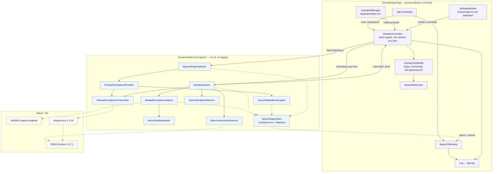
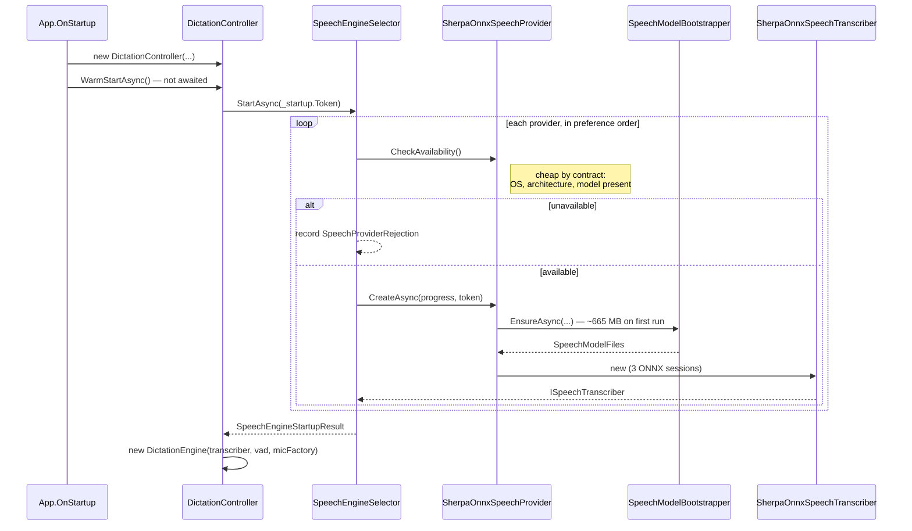
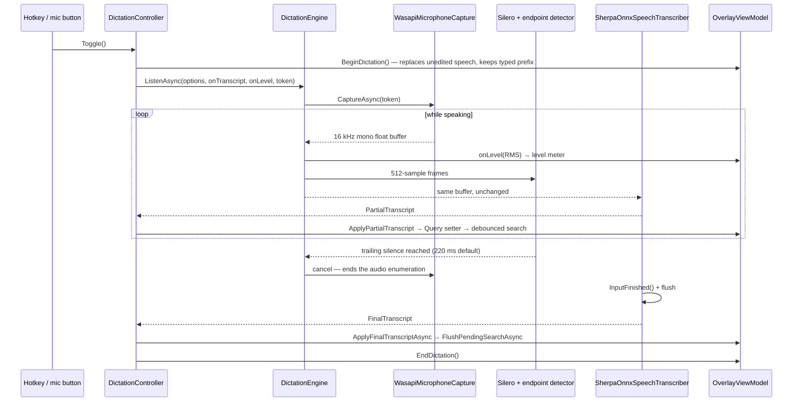
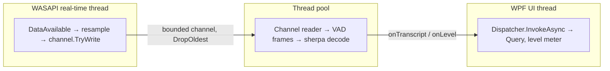
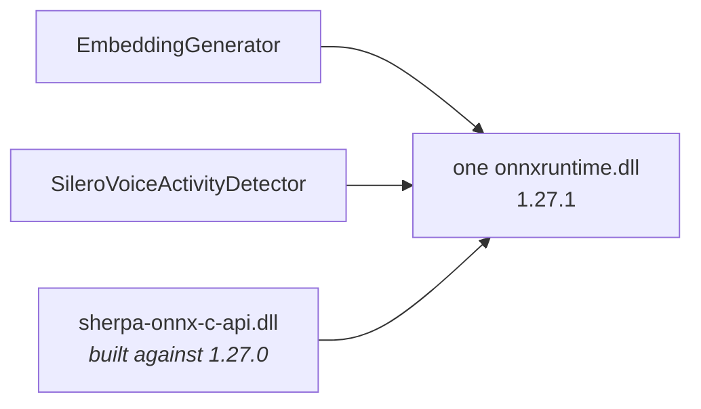

# Speech architecture

A reference for reviewing the dictation feature. For where this sits in the rest of the product,
see [`architecture.md`](architecture.md).

The whole of dictation does one thing: it sets `OverlayViewModel.Query`. Nothing downstream of the
query box — search, ranking, launching — knows the text arrived by voice. That is the boundary to
hold in mind while reading everything below.

Silero v5.1 consumes 512 new samples (32 ms at 16 kHz) preceded by the previous frame's
64-sample context. Context starts at zero and is reset along with recurrent state on each turn;
the ONNX input is `[1, 576]`, not `[1, 512]`. The streaming Parakeet recognizer decodes with
greedy search - its native implementation does not support beam search at all, unlike the
streaming Zipformer this app used before - so there is no `MaxActivePaths` to tune in
`speech-model.json` any more.

## The shape of it

Solid arrows are calls; dotted arrows are native boundaries or diagnostics, which are one-way and
never load-bearing.

## Two timelines, and why they are separate

Everything expensive happens once, at startup. Everything on the hotkey path is bookkeeping. This
is the single most important property of the design: a first utterance that loses its opening
words while a model loads is worse than one that never started.

### Startup — once per process

If this fails, the reason is *remembered*, not thrown — the rest of the app works fine without
dictation, and the reason is exactly what the user needs when they press the hotkey and nothing
happens. Every rejection is logged with its exception intact, not just the first one that reaches
the status line.

### One listening turn — per hotkey press

Two details in that diagram are load-bearing:

- **Audio is forwarded before it is examined.** `DictationEngine.EndpointedAudioAsync` yields each
  buffer to the transcriber and *then* feeds it to the VAD, so endpointing never sits between the
  microphone and the decoder.
- **Ending the audio is what produces the final.** The endpoint cancels the microphone rather than
  merely stopping the read, because the transcriber flushes on enumeration end. Without that, the
  last syllable of every utterance stays in the encoder's lookahead window.

## The pieces

| Type | Responsibility | Why it exists separately |
|---|---|---|
| `ISpeechTranscriber` | Audio in, transcripts out | Carries the local-only rationale, including why `Windows.Media.SpeechRecognition`, SAPI and Win+H are excluded |
| `ISpeechTranscriberProvider` | Availability + construction | Availability is answered without loading anything, so startup can ask every provider |
| `SpeechEngineSelector` | Picks a provider, keeps the rejections | The seam a second engine plugs into without touching settings or the overlay |
| `SpeechProviderMetadata` | Capability flags | Partial support and download size are read by the UI, so a batch-only engine needs no new branches |
| `PartialTranscript` / `FinalTranscript` | Two kinds of claim | Separate types, so a consumer that forgets the distinction fails to compile rather than launching on half a word |
| `IAudioCaptureSource` | The microphone, abstracted | Every audio consumer is testable from recorded samples; build servers have no microphone |
| `WasapiMicrophoneCapture` | Event-driven low-latency capture | Bounded channel with `DropOldest`: stalling WASAPI's real-time thread glitches capture for the whole machine |
| `MonoFloatResampler` | Device format → 16 kHz mono float | Stateful across buffers, so the seam between WASAPI packets does not dip |
| `SileroVoiceActivityDetector` | Per-frame speech probability | Recurrent state, so it belongs to one session and is reset between turns |
| `SpeechEndpointDetector` | Turns probabilities into "they have stopped" | Pure and testable; the tuning the user can see in Settings lives here |
| `SherpaOnnxSpeechTranscriber` | Streaming Parakeet decode | Its own endpointing is disabled — two endpoint rules would race |
| `DictationEngine` | Wires the above into one turn | Long-lived and warm; `ListenAsync` loads nothing |
| `SpeechModelBootstrapper` | Fetches models on first use | Mirrors `EmbeddingModelBootstrapper`: same temp file, progress and size floors |
| `SpeechModelOptions` | Where the models come from | Holds every URL, checksum and size floor, so a mirror or a newer revision is a `speech-model.json` away rather than a rebuild |
| `SpeechDiagnostics` | Spans + everything handled internally | Keeps Core log-free while making swallowed failures visible |
| `DictationController` | Hotkey → overlay, session lifetime | The only place that knows about both `Dispatcher` and `DictationEngine` |
| `SpeechTelemetry` | The one `ActivityListener` | Turns Core's spans into `TRACE` lines in the app's existing log |

## Threading

Decoding is synchronous CPU-bound work on whichever thread enumerates the transcript stream, and
that thread must never be the UI thread — `DictationController.RunSessionAsync` is what guarantees
it, by marshalling only the results back through the dispatcher.

## Failure paths

None of these are silent. The rule for this feature is that a dictation session producing no words
always has a reason attached.

| Failure | Where it surfaces | What the user sees |
|---|---|---|
| No microphone / access denied | `MicrophoneUnavailableException` with a `MicrophoneFailure` | The overlay names **"Let desktop apps access your microphone"** |
| Capture thread fault | NAudio's `RecordingStopped` → channel completion | Rethrown to the consumer, and reported to the log |
| Audio buffers dropped | Channel `itemDropped` counter | Trace line and a span tag — the audio thread has nobody to throw to |
| Microphone fails to stop | Reported, not rethrown | Log only; the session is ending either way |
| Provider fails to load | `SpeechProviderRejection` keeps the exception | Status line, with the stack in the log |
| Model download fails | `SpeechModelDownloadException` | Settings status text, partial file deleted |
| Shutdown mid-load | `_startup` token | Logged as shutdown, not as a failure |

## The ONNX Runtime constraint

`Microsoft.ML.OnnxRuntime` (the index's embedding model, and Silero) and `org.k2fsa.sherpa.onnx`
(the transcriber) both ship `runtimes/<rid>/native/onnxruntime.dll`, and a publish picks one
silently. ORT serves consumers built against the same or an *older* API, never a newer one, so the
surviving copy must be at least as new as sherpa's build target.

**The two package versions must be bumped together.** `ResolveDuplicateOnnxRuntimeNative` in
`SemanticStart.Core.csproj` makes the surviving copy a decision rather than item ordering, but it
does not make a mismatched pair safe.
