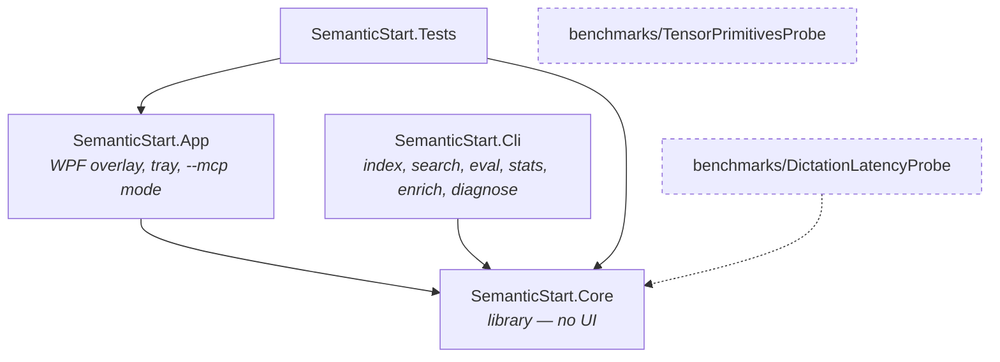
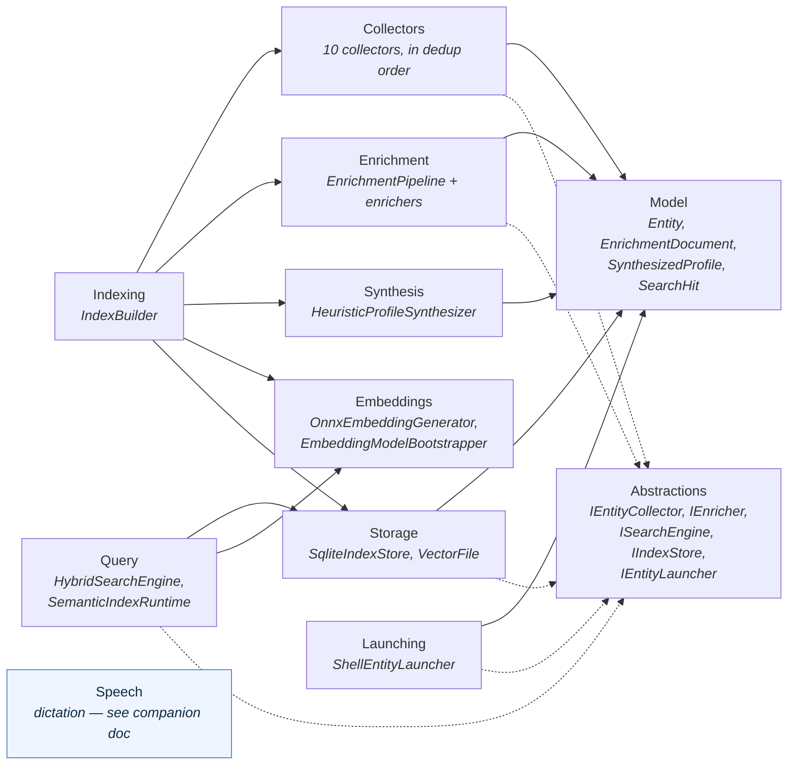
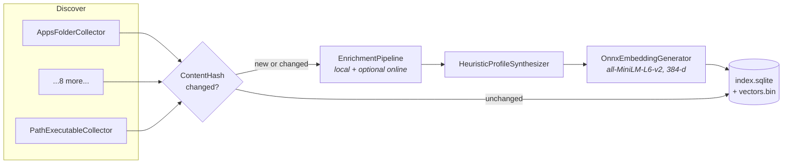
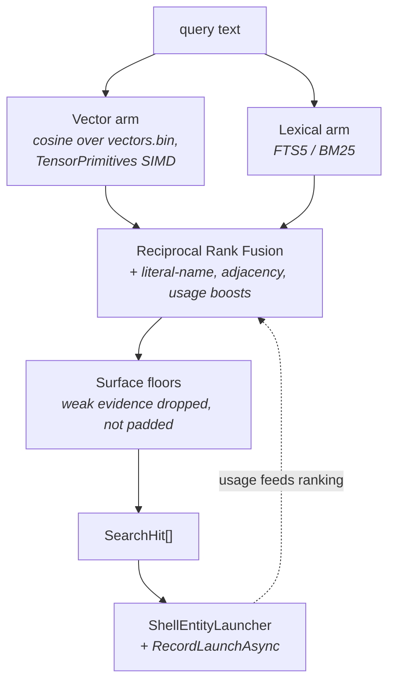
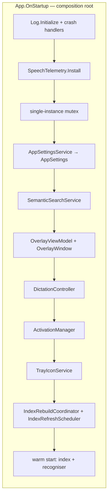
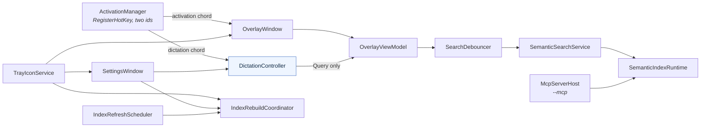
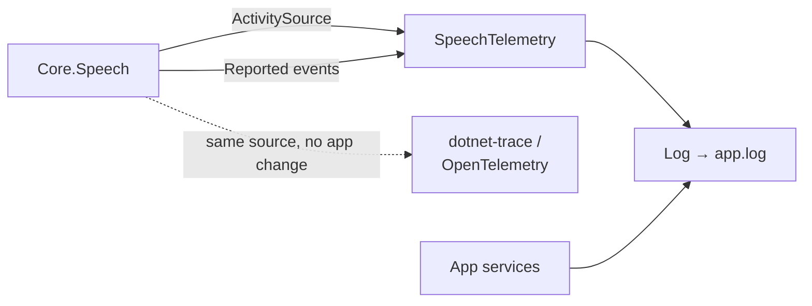

# Solution architecture

A map of the whole solution, for orientation during review. The dictation feature has its own
companion document: [`architecture-speech.md`](architecture-speech.md).

For the product-level explanation of the pipeline — why hybrid retrieval, which collectors, which
enrichers — see the **How it works** section of the [README](../README.md). This document is about
where the code lives and what calls what.

## Projects

Dashed projects are not in `SemanticStart.slnx` — they are run by hand on real hardware and are
deliberately kept out of the build. `Core` never references `App`: the query engine is a standalone
library with no UI dependency, so it can back a Command Palette or PowerToys Run extension later.

## Core, by folder

`Speech` sits apart on purpose: nothing else in Core depends on it, and it depends on nothing in
Core but `AppPaths`. It shares only the ONNX Runtime with `Embeddings` — which is the one real
coupling, and the reason the two native package versions must move together.

## Indexing — offline

Collector order is deduplication precedence: an earlier source wins when the same thing is found
twice, which is why `PathExecutableCollector` runs last. `IndexBuilder` drives the whole sequence
and reports through `IProgress<IndexProgress>`.

## Querying — the hot path

`HybridSearchEngine` owns fusion and ranking; `SemanticIndexRuntime` is the read-only, query-only
entry point used by both the overlay and the MCP server.

## The app

There is no DI container here. `App.xaml.cs` is a manual composition root: it constructs each
service in order and disposes it in `OnExit`. The one exception is `McpServerHost`, which uses
`Host.CreateApplicationBuilder` because the MCP SDK requires it.

The arrow to watch in review is `DictationController → OverlayViewModel`. It is the *only* edge
this PR adds into the existing query path, and it sets `Query` and nothing else — partials through
the ordinary setter so `SearchDebouncer` decides when to search, finals flushing it.

## On disk

All under `%LOCALAPPDATA%\SemanticStart` (`AppPaths.Root`, overridable with `SEMANTICSTART_HOME`):

| Path | Contents |
|---|---|
| `index.sqlite` | Entities, enrichment documents, profiles, FTS5 mirror, usage stats |
| `vectors.bin` | L2-normalized 384-d embeddings, row-major |
| `models/` | `all-MiniLM-L6-v2` for the index; the Zipformer and Silero models for dictation |
| `cache/enrichment/`, `cache/icons/` | Cached online payloads and extracted shell icons |
| `settings.json` | `AppSettings` |
| `logs/app.log` | The single log, `INFO` / `TRACE` / `ERROR` lines |

## Observability

`SemanticStart.Core` does not log. It reports progress through `IProgress<T>` and failure through
exceptions, and the app decides what to write. Dictation keeps that rule: it emits
`System.Diagnostics.Activity` spans on the `SemanticStart.Speech` source and
`SpeechDiagnostics.Reported` events for anything it handles internally, and `SpeechTelemetry` — in
the app, next to `Log` — is the single subscriber that turns those into lines in `app.log`.

Spans carry durations and lengths only; transcript text is never written anywhere.
